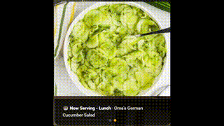

# ha-mealie-now-serving

A time-aware meal plan carousel for Home Assistant that integrates with [Mealie](https://mealie.io/). Automatically displays the current meal slot — breakfast, lunch, or supper — as an auto-advancing image slideshow with recipe name overlay.

[](https://youtu.be/MG_jH1pOrZ8)

> Click the image above to watch the demo video.

## Features

- 🕐 **Time-aware** — automatically switches between breakfast (before 10am), lunch (10am–3pm), and supper (after 3pm)
- 🎠 **Auto-advancing carousel** — cycles through all recipes planned for the current meal slot
- 🖼️ **Recipe images** — pulls images directly from your Mealie instance
- 🏷️ **Recipe name overlay** — displays the recipe name on each slide
- 👻 **Empty slot hiding** — slides with no planned recipe are automatically hidden
- 📱 **Swipeable** — manual swipe supported on touch screens

## Supports

- Up to 4 breakfast items
- Up to 4 lunch items
- Up to 6 supper items (dinner + sides + dessert combined)

## Tested Versions

| Component | Version |
|-----------|---------|
| Mealie | v3.19.2 |
| Home Assistant | 2025.6 or later |
| Simple Swipe Card | Latest |
| card-mod | Latest |

## Requirements

| Requirement | Minimum Version | Notes |
|-------------|----------------|-------|
| Home Assistant | 2025.1.0 | Required for `template: image:` and Mealie integration |
| Mealie | v1.9.0+ | Required for AI fallback URL scraping |

## Prerequisites

### Home Assistant Integrations
- [Mealie Integration](https://www.home-assistant.io/integrations/mealie/) (built-in, no HACS required — added in HA 2024.7)

### HACS Frontend Cards
- [Simple Swipe Card](https://github.com/nickmills/simple-swipe-card)
- [card-mod](https://github.com/thomasloven/lovelace-card-mod)

## Installation

### Step 1 — Install HACS dependencies

Install both **Simple Swipe Card** and **card-mod** via HACS → Frontend.

### Add this repo as a Custom Repository in HACS (optional)

This repo can be added as a custom repository in HACS so you can track updates:

1. In Home Assistant open HACS
2. Click the **three dots menu** (top right) → **Custom Repositories**
3. Paste `bferd/ha-mealie-now-serving` in the Repository field
4. Set Category to **Template**
5. Click **Add**

> Note: This repo will not appear in the HACS default store — it must be added as a custom repository. The package file still needs to be manually copied to your `config/packages/` folder as described below.

### Step 2 — Install the Mealie integration

In Home Assistant go to **Settings → Integrations → Add Integration → Mealie**.

Enter your Mealie URL (e.g. `http://YOUR_MEALIE_IP:9000`) and API token.

To generate an API token in Mealie: **User Settings → API Tokens → Create** (save the token — you only see it once).

### Step 3 — Enable HA Packages

In your `configuration.yaml`, ensure packages are enabled:

```yaml
homeassistant:
  packages: !include_dir_named packages
```

Create the `packages/` folder in your HA config directory if it doesn't exist.

### Step 4 — Add your API token to secrets.yaml

Open `secrets.yaml` in your HA config directory and add:

```yaml
mealie_api_token: Bearer YOUR_API_TOKEN_HERE
```

> ⚠️ **Important:** The word `Bearer ` (with a trailing space) MUST be included before the token. Without it the REST sensors will fail to authenticate.

### Step 5 — Create a Text helper for your Mealie URL

Go to **Settings → Devices & Services → Helpers → Create Helper → Text**.

- Name: `Mealie URL`
- Entity ID must be: `input_text.mealie_url`

After creating it, click on the helper and set its value to your Mealie URL, e.g. `http://192.168.1.x:9000`.

### Step 6 — Add the package file

Copy `packages/mealie_now_serving.yaml` into your `config/packages/` folder. No editing required — the URL and token are pulled from the helper and secrets.yaml automatically.

### Step 7 — Restart Home Assistant

Go to **Settings → System → Restart**.

### Step 8 — Verify sensors

Go to **Developer Tools → States** and confirm the following entities exist and are populated:

- `sensor.mealie_breakfast_1` through `sensor.mealie_breakfast_4`
- `sensor.mealie_lunch_1` through `sensor.mealie_lunch_4`
- `sensor.mealie_supper_1` through `sensor.mealie_supper_6`
- `sensor.mealie_meal_slot` (should show `breakfast`, `lunch`, or `supper`)
- `image.mealie_breakfast_1_image` through `image.mealie_supper_6_image`

### Step 9 — Add the Lovelace card

In your dashboard, add a new card → **Manual** and paste the contents of `lovelace/mealie_now_serving.yaml`.

## Time Slot Configuration

The meal slot times are configured in the package file. Edit `sensor.mealie_meal_slot` to change the cutoff times:

| Slot      | Default time     |
|-----------|-----------------|
| Breakfast | Before 10:00am  |
| Lunch     | 10:00am–3:00pm  |
| Supper    | After 3:00pm    |

## Customisation

### Image height
Change `height: 300px` in the Lovelace YAML to adjust the carousel image height.

### Auto-swipe interval
Change `auto_swipe_interval: 5000` (milliseconds) to adjust how long each slide is shown.

### Swipe effect
Change `swipe_effect: fade` to `slide` or other supported Simple Swipe Card effects.

### Meal slot labels
The overlay text (`🍳 Now Serving - Breakfast`, etc.) can be changed in the Lovelace YAML `content:` fields.

## Meal Types

Mealie entry types map to carousel slots as follows:

| Mealie Entry Type | Carousel Slot |
|-------------------|---------------|
| `breakfast`       | Breakfast     |
| `lunch`           | Lunch         |
| `dinner`          | Supper        |
| `side`            | Supper        |
| `dessert`         | Supper        |

## Known Limitations

- Maximum 4 breakfast items, 4 lunch items, and 6 supper items supported
- Mealie entry types `dinner`, `side`, and `dessert` are all grouped into the Supper carousel
- Mealie's meal planner recipe dropdown truncates alphabetically — use the search box to find recipes past the cutoff
- Recipe images must be stored locally in Mealie. If a recipe shows no image, open it in Mealie, edit it, and use the image refresh button to pull a local copy
- The meal plan data refreshes every **600 seconds** (10 minutes) by default. To change this, edit the `scan_interval` value in `packages/mealie_now_serving.yaml`. If you want to control this from the HA UI without editing the file, create a **Number helper** (`input_number.mealie_scan_interval`) and reference it in the package file — however a full restart is required for `scan_interval` changes to take effect regardless.

## Important Notes

- A **full HA restart** is required after dropping the package file in — a config reload alone is not sufficient
- The `Bearer ` prefix (with trailing space) is required in `secrets.yaml` before the API token
- The `input_text.mealie_url` entity ID must match exactly — the package file references it by that name

## Troubleshooting

**Sensors show `unavailable`**
- Check your API token is correct in `secrets.yaml` and includes the `Bearer ` prefix
- Confirm Mealie is reachable at the URL set in the `input_text.mealie_url` helper
- Reload REST entities: Developer Tools → YAML → REST Entities

**Images not showing**
- Ensure recipes in Mealie have locally stored images (open the recipe and use the image refresh button if needed)
- Check `image.mealie_breakfast_1_image` etc. exist in Developer Tools → States

**All three meal slots showing at once**
- Check `sensor.mealie_meal_slot` state in Developer Tools → States
- If it shows a value with leading/trailing whitespace, reload Template Entities: Developer Tools → YAML → Template Entities

**Empty slides still showing**
- Confirm the sensor for that slot shows `none` (not `unavailable`) in Developer Tools → States

## Credits

Built by [bferd](https://github.com/bferd).

Inspired by the [Mealie Home Assistant community guide](https://docs.mealie.io/documentation/community-guide/home-assistant/).

Requires:
- [Mealie](https://mealie.io/) by hay-kot
- [Simple Swipe Card](https://github.com/nickmills/simple-swipe-card)
- [card-mod](https://github.com/thomasloven/lovelace-card-mod)

## Support
 
If this project saved you some time or you just want to say thanks, a coffee is always appreciated!
 
[](https://buymeacoffee.com/schrothdotca)

## License

MIT
